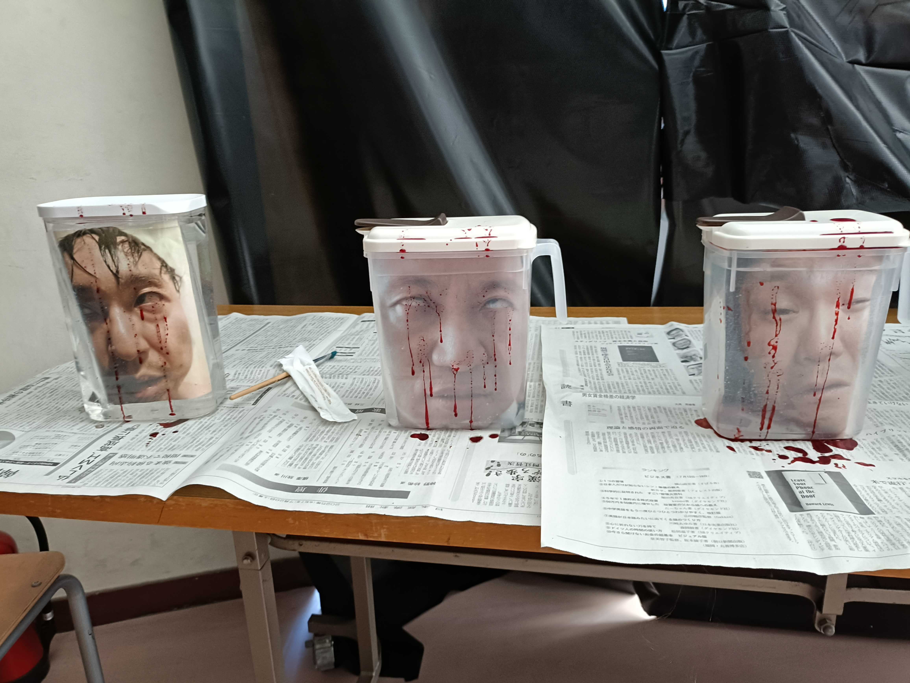

# 2026年肝試しブロック2 企画書

> Last Update: 2026-07-05

ブロック2の肝試し企画案まとめ。
装飾についてはこのリポジトリでは管理しない。

大きく3つのギミックを用意する。

| 番号 | ギミック                                                            |
|------|---------------------------------------------------------------------|
| 1    | [ブラックライトで足跡が浮かび上がる肝試しギミック](./footprints.md) |
| 2    | [モニター映像から死神が出てくる肝試しギミック](./movie.md)          |
| 3    | [お父さんのホルマリン漬け風ギミック](./formalin.md)                 |

---

> [!CAUTION]
> 以下は初回打ち合わせ時のバックアップ。

案まとめ。

### 顔落下（昨年と一緒）

顔が落下するギミックを使用。
追加購入品不要。

<video src="./sample.mp4" controls="true"></video>

### お父さんのホルマリン漬け（昨年と一緒）

麦茶ケースのような透明なケースにお父さんの顔を入れて、ホルマリン漬けのように見せる。
去年は暗くて目立たなかったので、採用するならライトアップする必要がある。

## 光る足跡

蓄光テープを使って足跡を作る。
ブラックライトで光らせる。

やりたいけど、ある程度購入品が必要になるので、予算と相談。

## PCとモニター持ち込んで動画

事前に同じ場所で撮影しておいた動画の中の人が、急に後ろから現れる。

撮影さえ出来てしまえば、動画作成は簡単なのでメンバー相談。

時間があれば当日のとって出し。

## （本当はやりたいけど多分無理）煙演出

グリセリンと純水で煙を発生させて紫色のようなライトで照らす。
熱感知式の火災報知器だったら大丈夫だが、リスクが大きいので事前調整は必須だし、万一のことを考えると、やるのは難しい。

## その他全般

- 急に大きな音が鳴るギミック
- 不気味な音楽は常に流しておく
