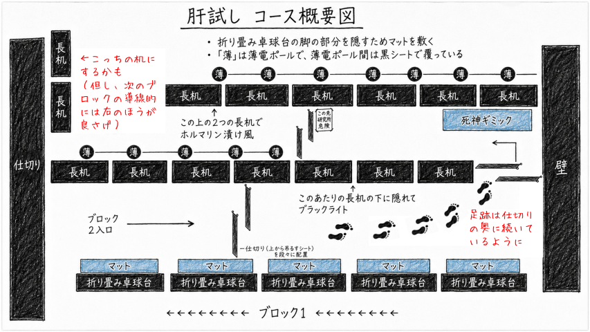

# 2026年肝試しブロック2 企画書

> Last Update: 2026-07-24

ブロック2の肝試し企画案まとめ。
装飾についてはこのリポジトリでは管理しない。

大きく3つのギミックを用意する。

| 番号 | ギミック                                                         |
|------|------------------------------------------------------------------|
| 1    | [ブラックライトで足跡が浮かび上がるギミック](docs/footprints.md) |
| 2    | [モニター映像から死神が出てくるギミック](docs/movie.md)          |
| 3    | [お父さんのホルマリン漬け風ギミック](docs/formalin.md)           |

> [!NOTE]
> もし体制に余裕があれば、以下を追加する。

4. [封印された箱の中から手が出てくるギミック](docs/box.md)

## 配置計画

下図のようにギミックを配置する。

> [!CAUTION]
> あくまで配置計画のイメージであり、実際の配置は現場の状況に応じて変更する。
>
> 配置計画は [#3](https://github.com/deckle123/kimodameshi2026/issues/3) で議論する。

---

> [!NOTE]
> 以下は初回打ち合わせ時のバックアップは [proposal.md](docs/proposal.md) 参照。
