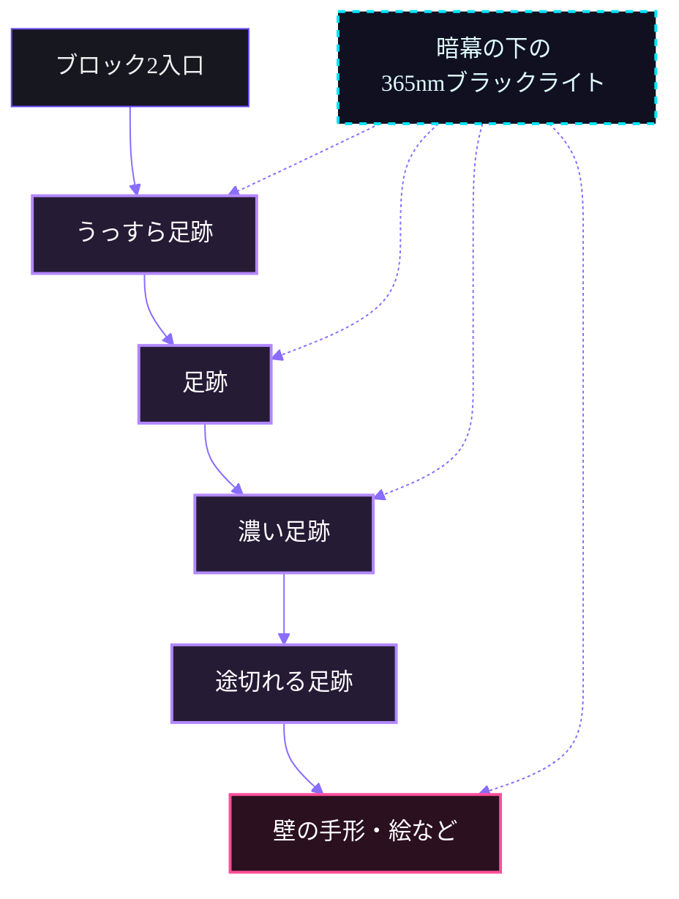

# ブラックライトで足跡が浮かび上がる肝試しギミック

> Last Update: 2026-07-05

## 前提構成

今回のギミックは、以下の構成を前提にする。

| 項目           | 内容                                                               |
|----------------|--------------------------------------------------------------------|
| ブラックライト | 365nm・20〜30Wクラス                                               |
| 塗料           | マジックルミノ（これが一番よさそうだが、代替製品がなければこれで） |
| 主な演出       | ブラックライトを当てると、床の足跡や壁の絵・手形が浮かび上がる     |
| 設置方法       | 足跡は透明シートに塗って床に貼る                                   |
| 照射方法       | 暗幕下からの斜め照射                                               |

現在の想定購入品リンク。

- [ブラックライト](https://www.amazon.co.jp/dp/B0DN5KVFL9?ref=cm_sw_r_cso_li_apin_dp_E3566DF22YN1DB91HF7F&ref_=cm_sw_r_cso_li_apin_dp_E3566DF22YN1DB91HF7F&social_share=cm_sw_r_cso_li_apin_dp_E3566DF22YN1DB91HF7F&openExternalBrowser=1&th=1)
- [塗料](https://www.amazon.co.jp/%E5%BB%BA%E6%9D%90%E3%82%B7%E3%83%A7%E3%83%83%E3%83%97%E3%83%8D%E3%83%83%E3%83%88%E8%B2%A9%E5%A3%B2%E5%93%81-%E3%83%96%E3%83%AB%E3%83%BC-%E3%83%9E%E3%82%B8%E3%83%83%E3%82%AF%E3%83%AB%E3%83%9F%E3%83%8E-50g-%E3%83%96%E3%83%AB%E3%83%BC/dp/B0064X326G/ref=sr_1_3?dib=eyJ2IjoiMSJ9.JqR8cGNhSHv_4hc73gkGiMaq7l1V-P_GMRgUcw_pSYhIQNIHdTHDNi9f4HP6dNCybA8-Lu_eihpGb3ygwjdqKpYA69UWrBIMX9N9TEpESIk.p-Yk8Fte41t2Im6sPRr4tb3XA1mCDFCqvy7UJjVfV0s&dib_tag=se&keywords=%E3%83%9E%E3%82%B8%E3%83%83%E3%82%AF%E3%83%AB%E3%83%9F%E3%83%8E+%E8%B5%A4&qid=1783228674&sr=8-3)

## 目的

肝試しの通路で、普段は見えにくい足跡・手形・文字・絵などを仕込み、ブラックライトを当てたときだけ浮かび上がる演出を作る。

想定する演出は以下。

* 床に足跡が浮かび上がる
* 足跡が奥へ続いているように見せる
* 足跡の先に壁の絵・手形・文字を出す
* 横の暗幕の下からライトを当て、光源を見せずに足跡を浮かび上がらせる

## ブラックライトの条件

### 推奨スペック

| 項目     | 推奨                           |
|----------|--------------------------------|
| 波長     | 365nm                          |
| 出力     | 20〜30W                        |
| 調光     | 無段階調光があると便利         |
| 電源     | USB充電式またはUSB給電式       |
| 用途     | 床の足跡照射、壁の絵・手形照射 |
| 照射距離 | 床なら1〜2m程度が実用的        |

### 365nmを選ぶ理由

365nmは、390〜400nm系のブラックライトよりも紫色の光そのものが目立ちにくい。

そのため、
**「ライトの紫色で照らしている」感じよりも、「隠していた足跡だけが浮かび上がる」感じを出しやすい。**

今回のような肝試し演出では、365nmが向いている。

## マジックルミノの使い方

マジックルミノは、ブラックライトを当てると発光する塗料として使う。

### 向いている用途

* 足跡
* 手形
* 壁の文字
* 壁の絵
* 引きずった跡
* 矢印や誘導マーク

### 注意点

マジックルミノは、完全に「通常時は絶対に見えない」タイプとは限らない。

そのため、以下は必ず事前に確認する。

| 確認項目             | 内容                                 |
|----------------------|--------------------------------------|
| 通常光での見え方     | 明るい場所で塗った跡が見えすぎないか |
| 暗所での見え方       | ブラックライトなしで目立たないか     |
| ブラックライト照射時 | 十分に光るか                         |
| 乾燥後の状態         | べたつきや剥がれがないか             |
| 床材への影響         | 直接塗らず、透明シートで確認する     |

## 足跡の作り方

床に直接塗るのは避ける。

床材に跡が残る可能性があるため。また、撤収ややり直しもしにくくなる。

### 作り方

1. 透明PPシート、クリアファイル、透明養生シートなどを用意する
2. 足跡型のステンシルを作る
3. マジックルミノをスポンジや筆で塗る
4. 乾燥させる
5. ブラックライトで発光確認する
6. 本番の床に養生テープなどで固定する

## 足跡デザイン

足跡は、きれいにベタ塗りするよりも、少しかすれた感じにしたほうが怖く見える。

### 表現

* 泥の足跡のように、部分的にかすれさせる
* 最初は薄く、奥に行くほど濃くする
* 足跡の間隔を少し不自然にする
* 途中で足跡を消して、壁に手形を出す
* 引きずったような線を混ぜる
* 最後だけ大きな手形や文字につなげる

### 配置例

> [!NOTE]
> あくまでイメージで一例。当日の通路の長さや暗さに応じて調整する。

## 手持ちライトで照らす場合

365nm・20〜30Wクラスであれば、床の足跡はかなり実用的に見える想定。

### 距離の目安

| ライトから足跡までの距離 | 見え方                       |
|--------------------------|------------------------------|
| 0.5m                     | かなり見えやすい             |
| 1m                       | 安定して見える               |
| 1.5〜2m                  | 実用範囲                     |
| 3m前後                   | 塗り方や暗さ次第             |

## 想定レイアウト

### 床の足跡

* 暗幕の下から、床に対して15〜25度で照射
* ライトから足跡まで70cm〜1.5m程度
* 足跡は透明シートに作成して床へ貼る
* シートの端は養生テープでしっかり固定する

### 壁の演出

* 足跡の先に手形や文字を配置する
* 壁の絵は大きめに描く
* 細かい線より、太めの線や面で描く

## 予算目安

### 基本構成

> [!NOTE]
> できるだけ備品を使いまわす。
> また、持っている人がいないか事前に確認する。

| 品目                         | 目安                 |
|------------------------------|----------------------|
| 365nm・20〜30Wブラックライト | 3,000〜5,000円程度   |
| マジックルミノ               | 1,000〜2,000円程度   |
| 透明シート・クリアファイル   | 100〜500円程度       |
| 養生テープ                   | 300〜600円程度       |
| 筆・スポンジ                 | 100〜500円程度       |
| 合計                         | 約4,500〜8,500円程度 |

## 本番前テスト

本番前に、試作品で確認する。

### テスト確認表

| テスト内容   | 確認ポイント                     | チェックボックス |
|--------------|----------------------------------|------------------|
| 通常光で確認 | 足跡が見えすぎないか             | ☐                |
| 暗所で確認   | ブラックライトなしで目立たないか | ☐                |
| 0.5m照射     | 確実に光るか                     | ☐                |
| 1m照射       | 本番距離で見えるか               | ☐                |
| 2m照射       | 少し離れても見えるか             | ☐                |
| 暗幕下照射   | 角度15〜25度で見えるか           | ☐                |
| 床固定       | シートやテープが浮かないか       | ☐                |
| 歩行確認     | つまずく危険がないか             | ☐                |

## 安全面の注意

* ブラックライトを人の目に直接向けない
* 参加者の目線に光源が入らないようにする
* ライトは暗幕の内側に隠し、直接見えないようにする
* 床に直接塗らない
* 透明シートの端が浮かないようにする
* 養生テープでしっかり固定する
* 通路の足元に段差を作らない
* ケーブルを使う場合は、通路を横切らせない
* 本番前に必ず歩いて確認する
