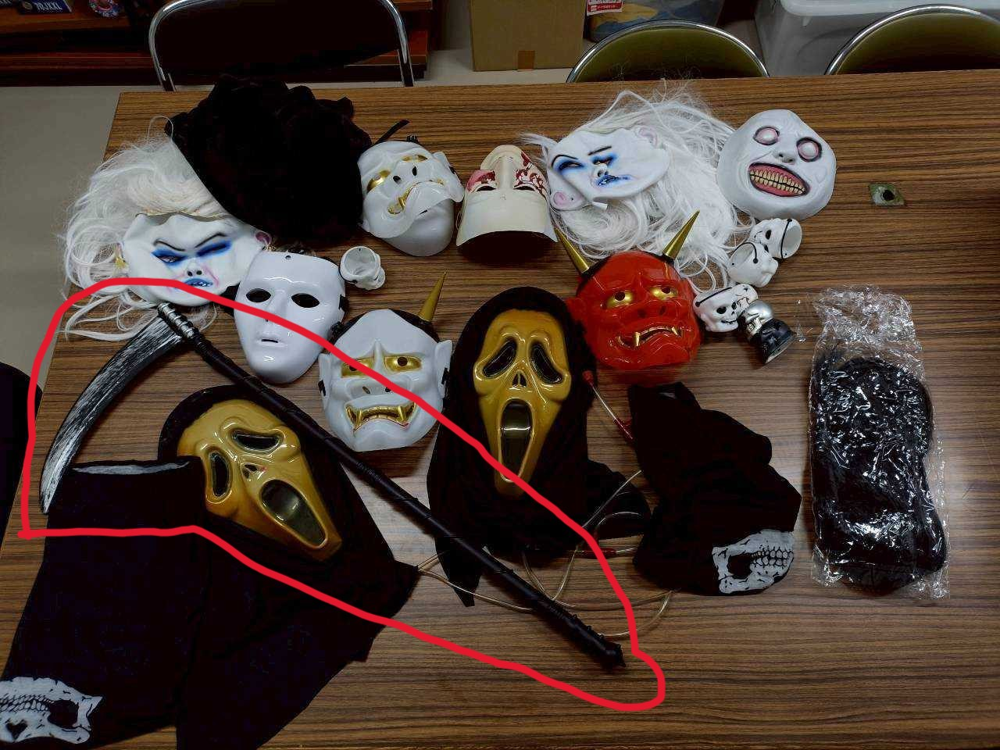
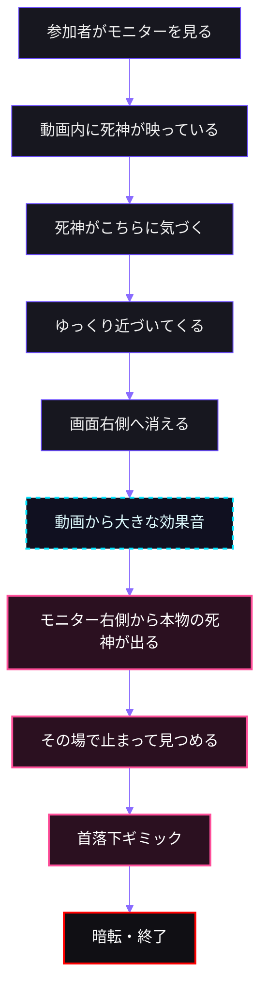
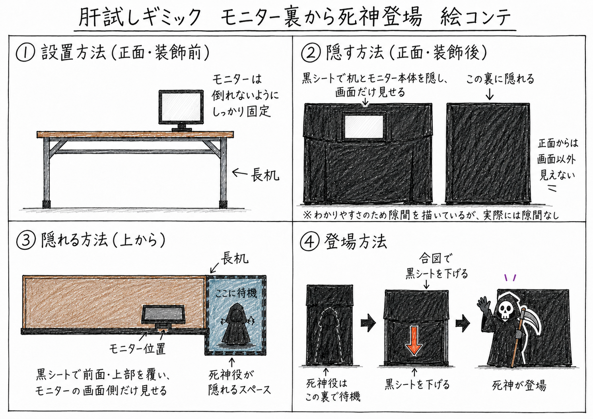
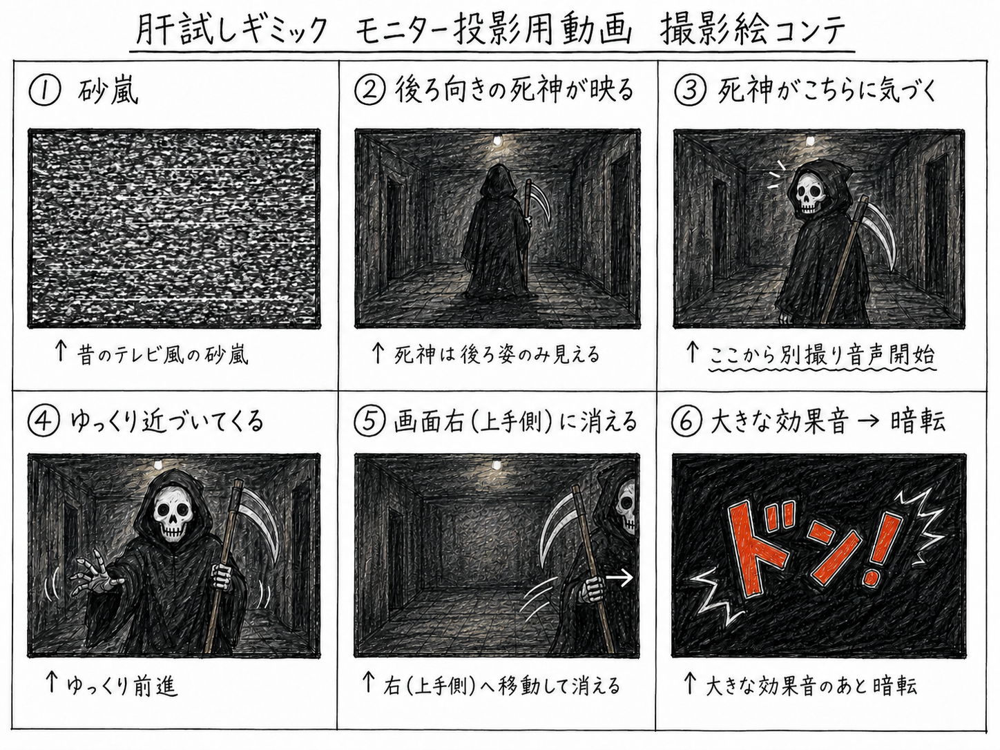

# モニター映像から死神が出てくるギミック

> Last Update: 2026-07-07

## ギミック概要

モニターに、当日と同じ場所で撮影した死神の動画を流しておく。

> [!NOTE]
> モニターは壊れかけで廃棄予定のものが家にあるので、それを持ち込む

動画の中の死神がこちらに気づき、ゆっくり近づいてくる。
最後に画面右側へ消えた直後、モニター右側の暗幕や物陰から本物の死神が飛び出す。

飛び出すタイミングで、動画側から大きな効果音を鳴らして驚かせる。
その後、首が落下したように見せるギミック（道具は去年作成したものを使いまわし）を使い、さらに驚かせる。

> [!IMPORTANT]
> 写真の備品を使いたいのでブロック担当リーダーに事前確認。
>
> 

## 前提

| 項目         | 内容                                             |
|--------------|--------------------------------------------------|
| キャラクター | 死神                                             |
| 衣装         | 去年の備品を使用                                 |
| 既存備品     | 仮面、鎌                                         |
| 追加購入候補 | マント                                           |
| 動画パターン | 動画の人物が画面右へ消え、同じ右側から本物が出る |
| 効果音       | 本物が出るタイミングで、動画から大きな音を出す   |
| 追加ギミック | 首が落下したように見せるギミック                 |

## 演出の流れ

## 動画の長さ

動画は長すぎると参加者が飽きたり、途中で先に進もうとしたりする。
今回は **15〜25秒程度** を想定。

### 動画構成案（絵コンテ）

### 重要ポイント

* 本物が出る方向と、動画内で死神が消える方向を合わせる
* 本物はモニター右側、または右側の暗幕の裏に隠れる
* 動画の最後は、死神を画面右側へ移動させる
* 死神が完全に画面外へ消えた瞬間に効果音を鳴らす
* 効果音と同時、または0.2〜0.5秒後に本物が出る

## 死神の衣装

去年の備品として、**仮面と鎌** があるため、それを活用する（**要事前調整**）。

### 使用するもの

| 品目             | 状態             |
|------------------|------------------|
| 死神の仮面       | 既存備品を使用   |
| 鎌               | 既存備品を使用   |
| マント           | 追加購入を検討   |
| 黒い手袋         | あれば追加       |
| 黒い服・黒ズボン | 手持ちで代用可能 |

## 動画撮影のポイント

動画は、当日と同じ場所で撮影する。

### 撮影時の注意

| 項目       | ポイント                             |
|------------|--------------------------------------|
| 撮影場所   | 本番と同じ場所                       |
| カメラ位置 | 参加者がモニターを見る角度に近づける |
| 明るさ     | 本番と同じ暗さにする                 |
| 死神の衣装 | 本物が出るときと同じ衣装にする       |
| 動き       | ゆっくり、不自然に近づく             |
| 最後       | 必ず画面右側へ消える                 |
| 音         | 最後に大きな効果音を入れる           |

## 効果音の入れ方

本物が出るタイミングで、動画から大きな音を出す。

### 音の候補

* ドンという低い衝撃音
* テレビノイズ音
* 金属を引きずる音
* 鎌が鳴るような金属音
* 低い叫び声
* 突然の無音からの衝撃音

## 本物の死神の動き

飛び出した後は、安全のため参加者に向かって走らない。

### 想定の動き

1. 効果音と同時に出る
2. 鎌を持って一歩だけ出る
3. その場で止まる
4. 参加者を見つめる
5. 少し間を置く
6. 首落下ギミックを発動する

## 安全面の注意

* 参加者に向かって走らない
* 参加者の進路をふさがない
* 飛び出し役は一歩出たら止まる
* 参加者との距離は1.5〜2m以上取る
* 鎌を振り回さない
* 鎌の先端が硬い場合は人に向けない
* 大きな音を耳元で鳴らさない
* モニターや暗幕が倒れないように固定する
* コードを通路に出さない
* 驚いた参加者が後ろに下がれるスペースを確保する
